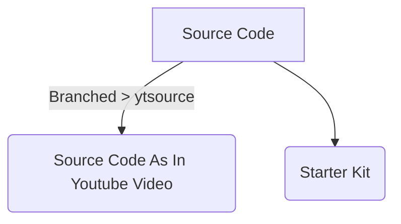

# Node Passport Authentication

## [Tutorial](https://youtu.be/vkIltwAySrk)

## 1. USAGE

```
        # Use your Own URI To Connect To Database
    $ npm install
    $ npm run dev

        # Visit http://localhost:5000
```

## Packages

1. Express
2. ejs
3. Mongoose
4. BcryptJS
5. passport
6. passport-local
7. express-session
8. cookie-parser
9. connect-flash



## Directory Structure

```bash
|   .gitignore
|   index.js
|   models.js
|   package-lock.json
|   package.json
|   README.md
|   routes.js
|
+---config
|       mongokey.js
|
\---views
    |   index.ejs
    |   login.ejs
    |   success.ejs
    |
    \---bare_templates
            login.html
            register.html
```

```bash
	npm cache verify
	npm cache clean --force (Optional)
	npm install
	npm start
```

TODO

1. add login signup error message
